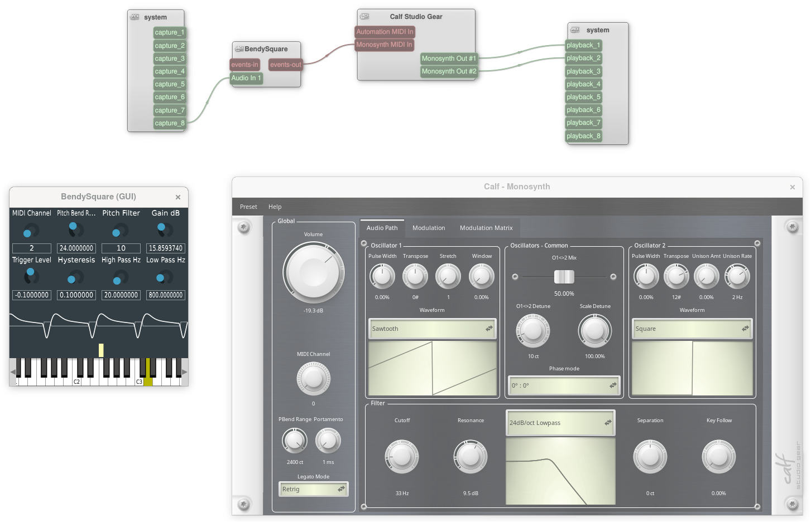

# bendysquare

Convert square wave to MIDI with pitch bend, for monophonic synths like the Otamatone.

There are many ways to do real-time pitch detection, but this one is optimized for low latency and high accuracy when the input is a simple square wave.

This is an LV2 plugin that needs JUCE 7 to build.

